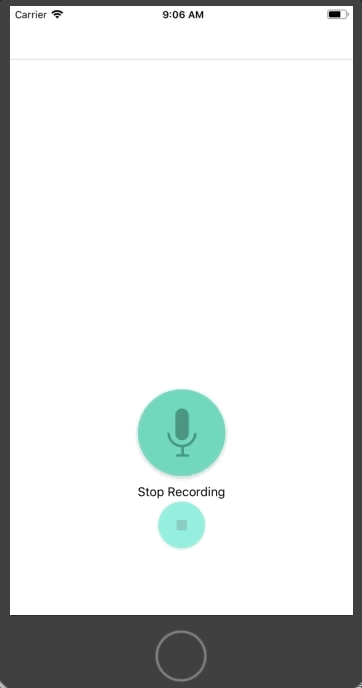

<h1 align="center"> Pitch Perfect </h1> <br>

<h4 align="center">Audio input app which allows you to apply effects to a recording</h4> <br>
 

## Intro

This project allows you to make a recording, then apply one of several sound transformation effects to the audio.  

<p align="center">
  
</p>
<br>

## Functions 

* Start audio recording on button press.
* Save audio and load effects UI.  
* Allow user to select one of six sound transform effects and replay audio. 
<br>

## Methods on the Main Thread

An interesting aspect of the controllers came from the recordAudio function. In addition to saving the file, this included some of the many parameters available to the audioRecorder method.  

``` swift
@IBAction func recordAudio(_ sender: AnyObject) {
        
         labelSetting(Bool1: true, Bool2: false, Text: "Recording in Progress")
        let dirPath = NSSearchPathForDirectoriesInDomains(.documentDirectory,.userDomainMask, true)[0] as String
        let recordingName = "recordedVoice.wav"
        let pathArray = [dirPath, recordingName]
        let filePath = URL(string: pathArray.joined(separator: "/"))
        let session = AVAudioSession.sharedInstance()
        try! session.setCategory(AVAudioSessionCategoryPlayAndRecord, with:.defaultToSpeaker)
        

        try! audioRecorder = AVAudioRecorder(url: filePath!, settings: [:])
        audioRecorder.delegate = self
        audioRecorder.isMeteringEnabled = true
        audioRecorder.prepareToRecord()
        audioRecorder.record()
        
    }
```
<br>

## Article Tips

Some good articles for tips : <br>
* <a href="https://www.yudiz.com/working-with-unwind-segues-in-swift" target="_blank">Working with Segue unwinds in Swift</a><br>
* <a href="https://blog.supereasyapps.com/30-auto-layout-best-practices/#layout-ui-for-one-iphone" target="_blank">30 Auto Layout Best Practices</a>
